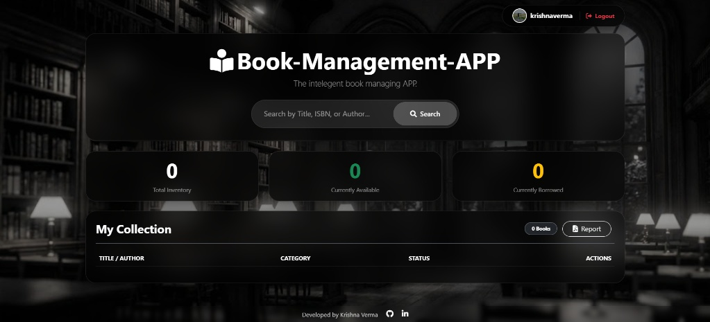

# 📚 Book-Management-APP

This is a Flask-based Book Management Application designed to help users manage their personal or small library collections. It integrates with the Google Books API for easy book discovery and includes user authentication, profile management, and PDF report generation.

## 📸 Screenshot

Here's a glimpse of the Book-Management-APP dashboard:



*(You will need to replace `static/images/dashboard-screenshot.png` with the actual path to your image file once you've saved it.)*

## ✨ Features

-   **User Authentication:** Secure login, registration, and password reset functionality with email-based token verification.
-   **Dashboard Overview:** At-a-glance statistics for total, available, and borrowed books.
-   **Google Books API Integration:** Search for books by title, author, or ISBN directly from the dashboard.
-   **Library Management:** Add new books to your collection, categorize them, and track their availability status (Available/Borrowed).
-   **PDF Report Generation:** Download a PDF report of your entire book collection.
-   **User Profiles:** Update personal information and profile pictures.
-   **Responsive UI:** Modern dark theme with glassmorphism design, built with Bootstrap 5.
-   **Email Notifications:** Welcome emails, password reset links, and account deletion confirmations.

## 🚀 Getting Started

Follow these steps to set up and run the application locally.

### Prerequisites

-   Python 3.8+
-   `pip` (Python package installer)

### Installation

1.  **Clone the repository:**
    ```bash
    git clone [https://github.com/krissshnaverrrma/Book-Management-APP.git](https://github.com/krissshnaverrrma/Book-Management-APP.git)
    cd Book-Management-APP
    ```

2.  **Create a virtual environment** (recommended):
    ```bash
    python -m venv venv
    ```

3.  **Activate the virtual environment:**
    -   On Windows:
        ```bash
        .\venv\Scripts\activate
        ```
    -   On macOS/Linux:
        ```bash
        source venv/bin/activate
        ```

4.  **Install dependencies:**
    ```bash
    pip install -r requirements.txt
    ```
    *(If `requirements.txt` doesn't exist, create it with `pip freeze > requirements.txt` after installing Flask, Flask-SQLAlchemy, Flask-Login, Flask-Mail, FPDF, Werkzeug, requests, python-dotenv (if used), secrets)*
    
### Running the Application

1.  **Ensure your virtual environment is active.**
2.  **Delete any old `library.db` file** if you're starting fresh or encounter database errors (`no such column`). This will create a new database with the correct schema.
3.  **Run the Flask application:**
    ```bash
    python app.py
    ```
    or
    ```bash
    flask run --debug
    ```

## 🙋 Contact
Development
For questions or feedback, please reach out to:
* **Developer:** Krishna Verma
* **GitHub:** [https://github.com/krissshnaverrrma]
* **Linkedin** [https://www.linkedin.com/in/krishna-verma-43aa85315/]
* **Email:** [krishnav24-cs@sanskar.org]

---